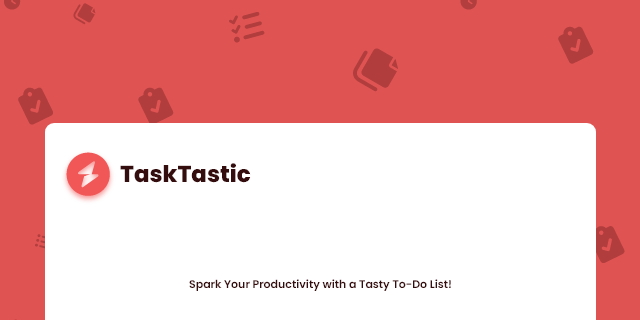

# Introduction
- Tasktify is a simple todo app built using Laravel 8 and Vue.js.

---

# How To Install
- Create .env file and go to this website to copy the default laravel .env. [Click me](https://github.com/laravel/laravel/blob/9.x/.env.example) or copy the .env.example from the files
- After that you can run `php artisan key:generate`
- Run `composer install && npm install`

